# Benchmark for Python multipart/form-data parsers

This repository contains scenarios and parser tests for different Python based
`multipart/form-data` parsers, comparing both blocking and non-blocking APIs (if
available). The [multipart](https://pypi.org/project/multipart/) library is used
as a baseline, because it is currently the fastest pure-python parser tested and
also the reason I'm benchmarking parsers in the first place.

## Contestants

* [multipart](https://pypi.org/project/multipart/) v2.0.0.dev0
  * Used in [Bottle](https://pypi.org/project/bottle/), [LiteStar](https://litestar.dev/), [Zope](https://zope.readthedocs.io/) and others.
  * [CPython docs](https://docs.python.org/3.12/library/cgi.html) recommend it as a `cgi.FieldStorage` replacement.
  * Disclaimer: I am the author and maintainer of this library.
* [werkzeug](https://pypi.org/project/Werkzeug/) v3.1.8
  * Used in [Flask](https://pypi.org/project/Flask/) and others.
  * Does a lot more than *just* multipart parsing.
* [django](https://pypi.org/project/Django/) v6.0.7
  * Full featured web framework, not just a parser.
* [python-multipart](https://pypi.org/project/python-multipart/) v0.0.32
  * Used in [Starlette](https://pypi.org/project/starlette/) and thus [FastAPI](https://pypi.org/project/fastapi/).
* [streaming-form-data](https://pypi.org/project/streaming-form-data/) v2.1.0
  * Partly written in Cython.
* [emmett-core](https://pypi.org/project/emmett-core/) v1.4.1
  * Mostly written in Rust.
  * Similar to Django or werkzeug, this library does a lot more than *just* multipart parsing. It is not a stand-alone parser, but a support library for the [emmett](https://emmett.sh/) framework and rarely used outside of this context.
* [cgi.FieldStorage](https://docs.python.org/3.12/library/cgi.html) CPython 3.12.3
  * Deprecated in Python 3.11 and removed in Python 3.13
* [email.parser.BytesFeedParser](https://docs.python.org/3.12/library/email.parser.html#email.parser.BytesFeedParser) CPython 3.12.3
  * Designed as a parser for emails, not `multipart/form-data`.
  * Buffers everything in memory, including large file uploads.

**Not included:** Some parsers *cheat* by loading the entire request body into memory
(e.g. sanic or litestar before they switched to multipart). Those are obviously
very fast in benchmarks but also very unpractical when dealing with large file
uploads.

## Updates

* **30.09.2024** `python-multipart` v0.0.11 fixed a bug that caused extreme
  slowdowns (as low as 0.75MB/s) in all three worst-case scenarios.
* **30.09.2024** There was an issue with the `email` parser that caused it to
  skip over the actual parsing and also not do any IO in the blocking test.
  Throughput was way higher than expected. This is fixed now.
* **30.09.2024** Default size for in-memory buffers is different for each parser,
  resulting in an unfair comparison. The tests now configure a limit of 500K for
  each parser, which is the hard-coded value in `werkzeug` and also a sensible
  default.
* **03.10.2024** New version of `multipart` with slightly better results in some tests.
* **05.10.2024** Added results for `streaming-form-data` parser.
* **25.10.2024** Added results for `django` parser.
* **06.11.2024** Added results for `emmett-core` parser.
* **24.12.2024** New versions for many libraries and an additional "worstcase_junk"
  scenario. The results were so bad for some of the libraries that I reported it
  as a potential security issue (DoS vulnerability) to the most affected libraries
  and waited for a fix to be available before publishing results.
* **09.07.2026** A lot has happened and new versions were released. I updated the
  benchmark runner to report mean throughput instead of the 'best' result of all runs,
  and let it run for as long as necessary to achieve stable results. This should reduce
  the impact of noise and give more realistic results. I also render some plots now.
  Enjoy :)

## Method

All tests were performed on a pretty old "AMD Ryzen 5 3600" running Linux 6.17.0
and Python 3.12.3 with highest possible priority and pinned to a single core.

For each test, the parser is created with default¹ settings and the results are
thrown away. Some parsers buffer to disk, but `TEMP` points to a ram-disk to
reduce disk IO from the equation. Each test is repeated until the relative
confidence interval around the trimmed² average runtime is narrow enough, then
the scenario input size is divided by that runtime to get a nice MB/s throughput
estimate per core.

The fastest pure-python parser (currently `multipart`) is used as the 100% baseline
for each test. This ensures that pure python parsers are always easy to compare
against each other, and parsers written in compiled languages can be included without
screwing with the results too much.

¹) There is one exception: The limit for in-memory buffered files is set to
500KB (hard-coded in `werkzeug`) to ensure a fair comparison.
²) We ignore the top and bottom 10% of all measurements per test to remove extreme
outliers, but still keep realistic outliers that may actually happen during
real-world operation due to allocation pressure or context switches.

## Results

Parser throughput is measured in MB/s (input size / time). Higher throughput is
better.

### Scenario: simple

**Description**: A simple form with just two small text fields.

This scenario is so small that it shows initialization and interpreter overhead
more than actual parsing performance, which benefits `emmett-core` the most
because everything happens in Rust and outside of the python runtime. The results
for `streaming-form-data` are a bit surprising though, given that it is partly
written in Cython and compiled to native code. My guess is that there is some
significant overhead when calling Python callbacks from Cython, which happens a
lot in this test. When comparing the pure-python parsers, `multipart` is the
clear winner.

**Note:** Small forms like these should better be transmitted as
`application/x-www-form-urlencoded`, which has a lot less overhead compared to
`multipart/form-data` and should be a lot faster to parse, so take this benchmark
with a large grain of salt. This is an uncommon and artificial scenario.

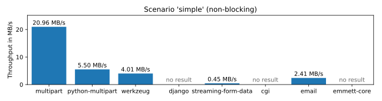

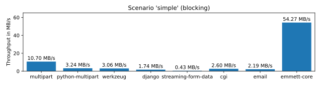

| Parser | Non-Blocking (MB/s) | Blocking (MB/s) |
|--------|---------------------|-----------------|
| multipart | 20.96 MB/s (100%) | 10.70 MB/s (100%) |
| python-multipart | 5.50 MB/s (26%) | 3.24 MB/s (30%) |
| werkzeug | 4.01 MB/s (19%) | 3.06 MB/s (29%) |
| django | - | 1.74 MB/s (16%) |
| streaming-form-data | 0.45 MB/s (2%) | 0.43 MB/s (4%) |
| cgi | - | 2.60 MB/s (24%) |
| email | 2.41 MB/s (11%) | 2.19 MB/s (20%) |
| emmett-core | - | 54.27 MB/s (507%) |

### Scenario: large

**Description**: A large form with 100 small text fields.

This scenario benefits parsers with low per-field overhead or a line-based
parser design (like `cgi` and `email`) because each field is just a single line,
and there are a lot of them. Initialization overhead is less important here
compared to the 'simple' scenario above.

No surprise that `emmett-core` performs well here, because the payload still
fits in a small number of chunks and other than `streaming-form-data` the parser
does not have to call into Python code for each field. The Rust parser thus
completely bypasses the python interpreter overhead. `email` also performs
reasonably well, as it is designed for this type of line-based text input and
even surpasses many of the other pure-python parsers, but `multipart` is still
more than three times as fast.

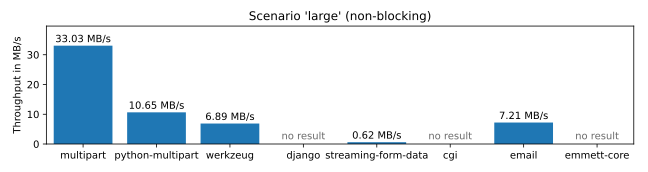

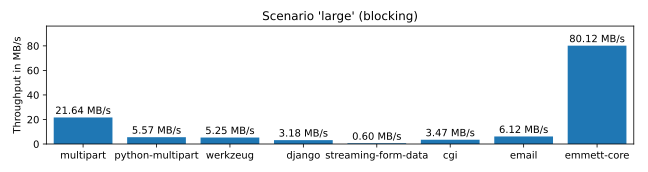

| Parser | Non-Blocking (MB/s) | Blocking (MB/s) |
|--------|---------------------|-----------------|
| multipart | 33.03 MB/s (100%) | 21.64 MB/s (100%) |
| python-multipart | 10.65 MB/s (32%) | 5.57 MB/s (26%) |
| werkzeug | 6.89 MB/s (21%) | 5.25 MB/s (24%) |
| django | - | 3.18 MB/s (15%) |
| streaming-form-data | 0.62 MB/s (2%) | 0.60 MB/s (3%) |
| cgi | - | 3.47 MB/s (16%) |
| email | 7.21 MB/s (22%) | 6.12 MB/s (28%) |
| emmett-core | - | 80.12 MB/s (370%) |

### Scenario: upload

**Description**: A file upload with a single large (32MB) file.

Now it gets interesting! When dealing with actual file uploads, both
`python-multipart` and `streaming-form-data` catch up and are now faster than
`werkzeug` or `django`. All four are slower than `multipart`, but the results
are still impressive. The line-based `cgi` and `email` parsers on the other hand
struggle a lot, probably because there are some line-breaks in the test file
input. This flaw shows even more in some of the tests below.

What really surprised me here was the poor performance of `emmett-core`. It
should be the fastest parser in all scenarios (because "Rust") but in the first
test that actually moves some bytes, it falls back significantly. My best guess
is that the context translation overhead between Python and the native Rust code
is to blame. The parser is fed chunks of bytes and each round involves call-overhead
and expensive copy operations. Pure python code can work directly with the
provided byte string and avoid some of that overhead. But that's just a guess.

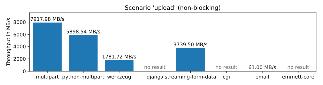

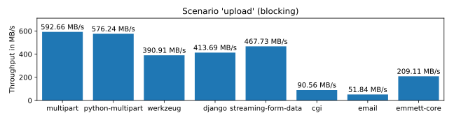

| Parser | Non-Blocking (MB/s) | Blocking (MB/s) |
|--------|---------------------|-----------------|
| multipart | 7917.98 MB/s (100%) | 592.66 MB/s (100%) |
| python-multipart | 5898.54 MB/s (74%) | 576.24 MB/s (97%) |
| werkzeug | 1781.72 MB/s (23%) | 390.91 MB/s (66%) |
| django | - | 413.69 MB/s (70%) |
| streaming-form-data | 3739.50 MB/s (47%) | 467.73 MB/s (79%) |
| cgi | - | 90.56 MB/s (15%) |
| email | 61.00 MB/s (1%) | 51.84 MB/s (9%) |
| emmett-core | - | 209.11 MB/s (35%) |

### Scenario: mixed

**Description**: A form with two text fields and two small file uploads (1MB and 2MB).

This is the most realistic test and shows similar results to the upload scenario.
`streaming-form-data` falls back a bit and is now closer to `werkzeug` and
`django`. `emmett-core` is unexpectedly slow again, slower than most modern
pure-python parsers, but still way faster than the line-based `cgi` and `email`
parsers. `multipart` outperforms all of them by a significant margin.

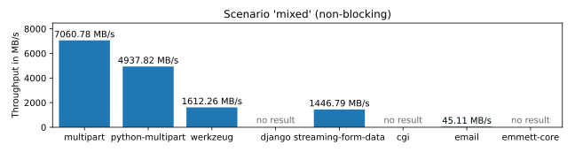

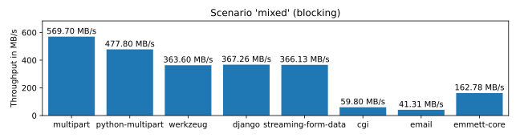

| Parser | Non-Blocking (MB/s) | Blocking (MB/s) |
|--------|---------------------|-----------------|
| multipart | 7060.78 MB/s (100%) | 569.70 MB/s (100%) |
| python-multipart | 4937.82 MB/s (70%) | 477.80 MB/s (84%) |
| werkzeug | 1612.26 MB/s (23%) | 363.60 MB/s (64%) |
| django | - | 367.26 MB/s (64%) |
| streaming-form-data | 1446.79 MB/s (20%) | 366.13 MB/s (64%) |
| cgi | - | 59.80 MB/s (10%) |
| email | 45.11 MB/s (1%) | 41.31 MB/s (7%) |
| emmett-core | - | 162.78 MB/s (29%) |

### Scenario: worstcase_crlf

**Description**: A 1MB upload that contains nothing but windows line-breaks.

This is the first scenario that should not happen under normal circumstances
but is still an important test if you want to prevent malicious uploads from
slowing down your web service. `multipart`, `python-multipart`, `werkzeug` and
`django` are mostly unaffected and produce consistent results. `emmett-core` is
still slower than the modern pure-python parsers, but not specifically because of
this input. `streaming-form-data` is now several magnitudes slower than it should be,
but still faster than the line-based parsers. Those choke on the high number of
line-breaks and are practically unusable.

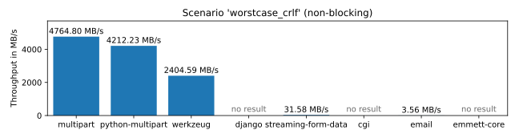

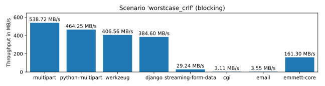

| Parser | Non-Blocking (MB/s) | Blocking (MB/s) |
|--------|---------------------|-----------------|
| multipart | 4764.80 MB/s (100%) | 538.72 MB/s (100%) |
| python-multipart | 4212.23 MB/s (88%) | 464.25 MB/s (86%) |
| werkzeug | 2404.59 MB/s (50%) | 406.56 MB/s (75%) |
| django | - | 384.60 MB/s (71%) |
| streaming-form-data | 31.58 MB/s (1%) | 29.24 MB/s (5%) |
| cgi | - | 3.11 MB/s (1%) |
| email | 3.56 MB/s (0%) | 3.55 MB/s (1%) |
| emmett-core | - | 161.30 MB/s (30%) |

### Scenario: worstcase_lf

**Description**: A 1MB upload that contains nothing but linux line-breaks.

Linux line breaks are not valid in segment headers or boundaries, which benefits
parsers that do not try to be nice and parse invalid input for compatibility
reasons. `streaming-form-data` is less affected this time and performs well. The
two line-based parsers on the other hand are even worse than before. Throughput is
roughly halved, probably because there are twice as many line-breaks (and thus
lines) in this scenario.

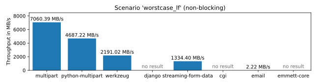

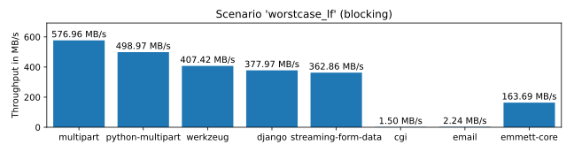

| Parser | Non-Blocking (MB/s) | Blocking (MB/s) |
|--------|---------------------|-----------------|
| multipart | 7060.39 MB/s (100%) | 576.96 MB/s (100%) |
| python-multipart | 4687.22 MB/s (66%) | 498.97 MB/s (86%) |
| werkzeug | 2191.02 MB/s (31%) | 407.42 MB/s (71%) |
| django | - | 377.97 MB/s (66%) |
| streaming-form-data | 1334.40 MB/s (19%) | 362.86 MB/s (63%) |
| cgi | - | 1.50 MB/s (0%) |
| email | 2.22 MB/s (0%) | 2.24 MB/s (0%) |
| emmett-core | - | 163.69 MB/s (28%) |

### Scenario: worstcase_bchar

**Description**: A 1MB upload that contains parts of the boundary.

This test was originally added to show an issue with `python-multipart`, but the biggest
slowdowns were fixed quickly after reporting. It still struggles a bit and is on par
with `werkzeug` in this test, but both are acceptable. `multipart` also slows down a bit
compared to the non-malicious scenarios, but is still significantly fatser than the
others. `streaming-form-data` takes the biggest hit here, it is now even slower than the
line-based legacy parsers.

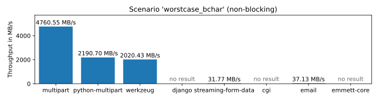

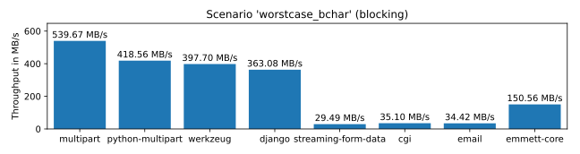

| Parser | Non-Blocking (MB/s) | Blocking (MB/s) |
|--------|---------------------|-----------------|
| multipart | 4760.55 MB/s (100%) | 539.67 MB/s (100%) |
| python-multipart | 2190.70 MB/s (46%) | 418.56 MB/s (78%) |
| werkzeug | 2020.43 MB/s (42%) | 397.70 MB/s (74%) |
| django | - | 363.08 MB/s (67%) |
| streaming-form-data | 31.77 MB/s (1%) | 29.49 MB/s (5%) |
| cgi | - | 35.10 MB/s (7%) |
| email | 37.13 MB/s (1%) | 34.42 MB/s (6%) |
| emmett-core | - | 150.56 MB/s (28%) |

### Scenario: worstcase_junk

**Description**: Junk before the first and after the last boundary (1MB each)

The legacy multipart protocol allows arbitrary junk before the first and after
the last boundary, and requires parsers to ignore it. This protocol 'feature' has
no practical use and no browser or HTTP client would ever do that, but parsers
still have to deal with it, one way or the other.

When this was first discovered, `multipart` was the only implementation not
showing a drastic slowdown in this test. All the other parsers spent way too
much time parsing and discarding junk. Some were so slow that I waited for
the most affected libraries to release fixes before I published any results, as
this may be abused for denial of service attacks, which can be a serious security
issue. The results are still really bad for most of the parsers, but not as
catastrophic as it was before. Update your dependencies!

Some of the parsers fail this test, but that's a good thing! Failing this test with a
fast exception is *way* better than beeing slow. Malicious input can and should be
rejected. `multipart` will also bail out very quickly in *strict* mode, but these tests
are run in default mode which accepts some amounts of unusual input for compatibility
reasons. It's still mostly unaffected, even in non-strict mode, as it manages to skip
junk fast enough.

You may have noticed that the blocking variants of most parsers are almost as fast as
the non-blocking versions in this scenario. This is because 'junk' does not emit any
parser events and the blocking parts of the parser do not have to do much.

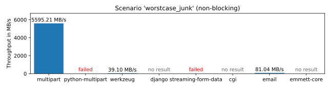

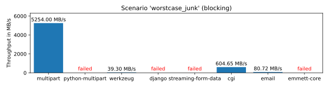

| Parser | Non-Blocking (MB/s) | Blocking (MB/s) |
|--------|---------------------|-----------------|
| multipart | 5595.21 MB/s (100%) | 5254.00 MB/s (100%) |
| python-multipart | *failed* | *failed* |
| werkzeug | 39.10 MB/s (1%) | 39.30 MB/s (1%) |
| django | - | *failed* |
| streaming-form-data | *failed* | *failed* |
| cgi | - | 604.65 MB/s (12%) |
| email | 81.04 MB/s (1%) | 80.72 MB/s (2%) |
| emmett-core | - | *failed* |

## Conclusion

All modern pure-python parsers (`multipart`, `werkzeug`, `python-multipart`) are
fast enough for most real-world use cases and behave correctly. All three offer
non-blocking APIs for asyncio/ASGI environments with very little overhead and a
high level of control. There are differences in API design, code quality,
maturity, support and documentation, but that's not the focus of this benchmark.
The `django` parser is also pretty solid, but hard to use outside of Django
applications.

For me, both `streaming-form-data` and `emmett-core` were a bit of a surprise.
Both are reasonably fast for large file uploads, but not as fast as you might
expect from parsers written in Cython or Rust. I would have never guessed that a
pure python parser can outperform both in the relevant tests. The overhead
introduced by those Python/native compatibility layers seems to be significant.
The results for those two parsers were also very different. Lessons learned:
Always measure. Just because something is implemented in a faster language does
not mean it's actually faster.

I probably do not need to talk much about `email` or `cgi`. Both show mixed
performance and are vulnerable to malicious inputs. `cgi` is deprecated (for
good reasons) and `email` is not designed for form data or large uploads at all.
Both are unsuitable or even dangerous to use in modern web applications.

All in all, `multipart` seems to be a good choice for new projects. It's highly
optimized with a strong focus on security, has 100% test coverage, no dependencies
and does exactly what it is supposed to do, in the best possible way. But don't just
take my word for it, I'm obviously biased as the author of that library. Look at the
results, look at the test cases, check out the projects, try them out and make up
your own mind.

Thanks for reading.

